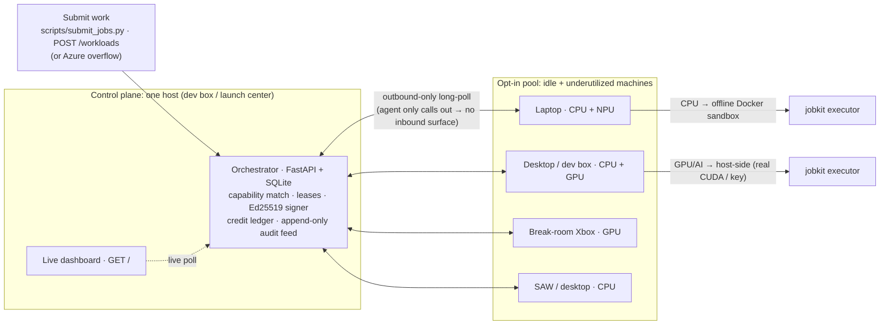
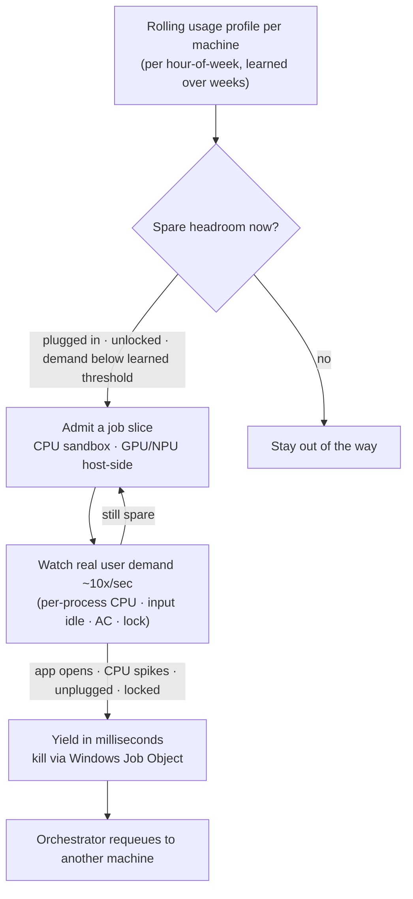
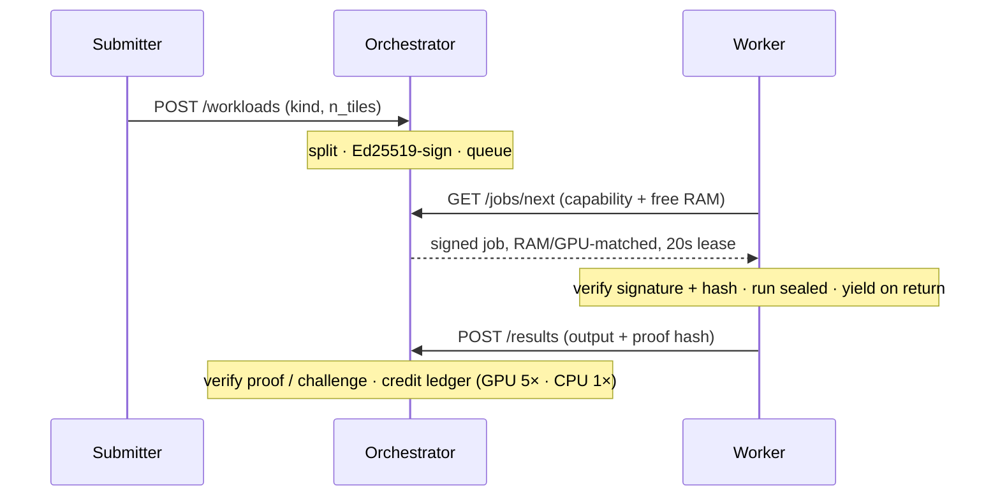

# OneCompute

**Turn Microsoft's idle and underutilized PCs into an on-demand/spot compute grid.**

OneCompute harvests the spare CPU/GPU capacity already sitting in employee laptops, desktops,
dev boxes, SAWs, and break-room Xboxes, and runs real distributed and AI workloads on it,
securely, while staying invisible to the person at the keyboard.

This repo is a **working proof-of-concept**: a real multi-machine fleet, a live dashboard, a
dozen example workloads (CPU/GPU/AI), and 159 passing tests.

---

## Why it matters

- **Capacity-constrained, not hardware-poor.** Microsoft's AI capex is on track for ~$100B this
  year, yet excess capacity at Redmond HQ alone ≈ **3.8B vCPU-hours/yr, a ~27,000-server data
  center**, sitting idle.
- **NPUs are free compute.** 45 TOPS × ~210k Snapdragon laptops = **9.45 ExaOPS, ~99.5% unused**.
- **Projected savings:** **~$432M in year one, ~$2.36B over five years** (net of added power + wear).
- **Employees share in it:** a pledged **5% of realized savings** returned as Microsoft tech, merch, tickets.
- **Complements Azure:** run spot/simple workloads on the desk fleet, burst to the cloud only when
  it's saturated. The upside compounds as **RTX / DGX Spark** hardware reaches employees' desks.

---

## Architecture

A Python + **FastAPI** control plane on a **SQLite** ledger, plus a lightweight worker agent on
each machine. Harvests **CPU** (sandboxed) and **GPU** (via CUDA) today, **NPU** next, across
laptops, desktops, dev boxes, SAWs, and Xboxes.



**Harvest *wasted* compute, not just idle machines.** Each worker learns a rolling per-machine
usage profile (per hour-of-week) and safely takes spare headroom **continuously, even while the
employee is using the machine**, then yields in **milliseconds** the instant they need it back.



**Every job is safe by construction:**



- **Signed** (Ed25519: a tampered job won't run) · **sealed** (offline Docker, `--network none`,
  killable via Windows Job Objects, wiped after) · **outbound-only** (no inbound surface; sits beside
  Defender / Intune / Purview) · **verified before credited** (proof hash + challenge ringers;
  credits assigned server-side). SOC 2-ready; designed to plug into Azure AI Foundry.

Full design: [`docs/architecture.md`](docs/architecture.md).

---

## Repository structure

```text
OneCompute/
├── src/
│   ├── orchestrator/   FastAPI control plane: scheduling, leases, crediting, API + dashboard
│   ├── worker/         Agent: capability detect, adaptive governor, usage profiler, instant-yield
│   ├── jobkit/         Frozen job executors: one place that knows how to run each job kind
│   ├── isolation/      Per-job sandbox: Docker container / Windows Job Object, sub-second kill
│   ├── trust/          Ed25519 signing + challenge-based result verification + metering
│   ├── contracts/      Frozen Pydantic models + SQLite schema shared across components
│   ├── workloads/      Example jobs (fractal, montecarlo, hashcrack, ai.*, …) + fleet split
│   └── dashboard/      Self-contained live console (polls the orchestrator API)
├── scripts/            submit_jobs.py (feed the fleet) · demo_fleet.py (one-box demo)
├── tests/              159 tests across orchestrator, worker, jobkit, isolation, trust
├── docs/               architecture · contracts · workloads · dashboard API · runbook
└── pyproject.toml      uv project (Python 3.13); entry points: python -m orchestrator | worker
```

---

## Quickstart

**Prerequisites:** [`uv`](https://docs.astral.sh/uv/) + Python 3.13. On each machine: clone, then `uv sync --extra dev`.

```bash
# 1. Start the orchestrator on any one host (prints the dashboard URL + worker command)
uv run python -m orchestrator

# 2. Join a worker (run on each laptop / desktop / dev box / GPU box)
uv run python -m worker --url http://<host-ip>:8080

# 3. Run a non-AI workload: distributed Mandelbrot, reassembled into one PNG
uv run python scripts/submit_jobs.py --url http://<host-ip>:8080 --kind fractal --n 3

# 4. Run an AI workload: batch LLM inference (set a key in the WORKER env; runs host-side)
export ANTHROPIC_API_KEY=sk-ant-...   # or OPENAI_API_KEY  ·  no key → disclosed deterministic fallback
uv run python scripts/submit_jobs.py --url http://<host-ip>:8080 --kind ai
```

**No second machine?** `uv run python scripts/demo_fleet.py` stands up a real orchestrator + 3 real
workers on one box, runs the full flow, and writes `onecompute-fractal.png`.

More workloads (`optimize`, `synth`, `fanout`, `gpu`, plus local-model `montecarlo`, `hashcrack`,
`ai.infer`, `ai.eval`, `ai.graph`) launch from the dashboard or `POST /workloads`. See
[`docs/workloads.md`](docs/workloads.md).

### Scaling

| Topology | Routing |
|---|---|
| **Multiple laptops** | Work fans across all; each earns credits for the tiles it finishes. |
| **Laptops + dev box** | Run the orchestrator on the always-on dev box; least-utilized-first keeps light machines unloaded. |
| **+ GPU machines / Xboxes** | `--kind gpu` jobs match **only** GPU workers, run host-side for real CUDA, credited **5×**. |

Workers heartbeat live CPU%, GPU%, **free RAM**, AC, and idle state; the scheduler bin-fits each job
against them (a job needing 8 GB only lands where 8 GB is free *right now*).

---

## Azure AI Foundry Roadmap

- **NPU harvesting** on Copilot+ PCs (40–55 TOPS) via ONNX Runtime + DirectML, another `accel` class.
- **RTX / NVIDIA DGX Spark** desks: a ~1 petaFLOP worker drops into the pool with no protocol change.
- **Cross-machine model sharding** for models too big for one box; **TEE confidential compute** as desk GPU enclaves arrive.

Market case and roadmap: [`docs/idea.md`](docs/idea.md).

---

## Tests

```bash
uv run pytest -q   # 159 passed
```

Covers capability matching, approval/auth, leases/requeue, verification + crediting, the governor &
instant-yield, isolation, the trust layer, every workload, and end-to-end multi-worker flows.

---

*OneCompute is an internal, opt-in research concept. Harvested throughput is reported as **measured**,
beside (never instead of) any theoretical hardware ceiling.*
