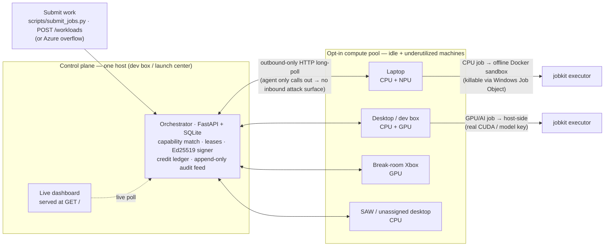
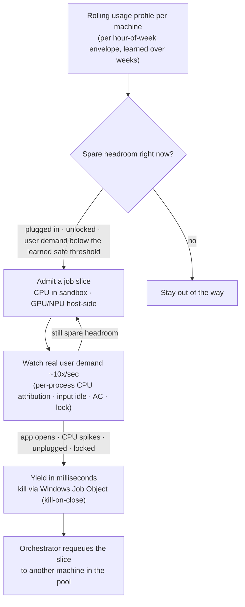
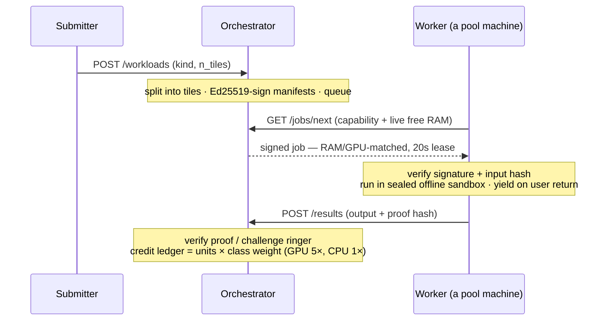

# OneCompute

**Let your compute work the night shift.**

Microsoft's AI capex is on track for **~$100B this year** — and we're *still* capacity-constrained,
leasing competitors' GPUs and even restarting a nuclear reactor to feed demand. Yet the compute we
already own sits idle: thousands of machines across campus do nothing every night, and tens of
thousands more are barely used during the day.

**OneCompute turns that idle and underutilized hardware into an opt-in, privacy-preserving internal
compute grid.** A lightweight worker on each machine registers with a central orchestrator, pulls
**cryptographically signed, sandboxed** jobs over an **outbound-only** connection (no inbound ports —
it works straight through corporate NAT/firewalls), runs them on the machine's *spare* headroom, and
**yields in milliseconds** the moment the human needs their machine back. Verified work earns credits.

This repo is a **working proof-of-concept**: a real multi-machine fleet, a live dashboard, a dozen
example workloads (CPU, GPU, and AI), and 159 passing tests.

> The codebase package and engine are codenamed **NightShift**; the product is **OneCompute** — same system.

---

## Why it matters

- **The waste is enormous.** Across Redmond HQ alone, excess CPU/GPU adds up to an estimated
  **3.8 billion vCPU-hours/year — a ~27,000-server data center** sitting idle. Every Snapdragon
  laptop ships a **45 TOPS NPU**; across ~210,000 of them that's **9.45 ExaOPS of on-device
  inference, ~99.5% of it unused**. This is capacity we've already paid for.
- **The savings are real.** Applied to Microsoft's usable fleet, projected net savings (after added
  electricity and hardware wear) are **~$432M in year one and ~$2.36B over five years** — by serving
  simpler/spot workloads on the desk fleet and reserving Azure for the rest.
- **Everyone wins.** **IT/Platform teams** get burst compute with no new capex; **employees** opt in
  and we pledge **5% of realized savings back to them** as Microsoft tech, merch, and event tickets;
  **Microsoft** gains a differentiated, sustainable fabric that complements Azure (overflow to the
  cloud only when the desk fleet is saturated). As **RTX / DGX Spark**-class hardware reaches
  employees' desks, the upside compounds.

---

## Architecture

OneCompute is a Python + **FastAPI** control plane on a **SQLite** ledger, with a lightweight worker
agent on each machine. It harvests across the whole hardware spread — **CPU** (in a sandbox),
**GPU** (via CUDA), and **NPU** (Copilot+ neural engines, roadmap) — and across every machine class
Microsoft owns: **employee laptops, unassigned desktops, dev boxes, SAWs, and break-room Xboxes**.



### Harvesting *wasted* compute — not just idle machines

Most "donate your idle PC" systems only run when a machine is **fully** idle. OneCompute goes further:
each worker runs an **adaptive headroom governor** (`src/worker/governor.py`) backed by a **rolling,
per-machine usage profile** (`src/worker/profiler.py`) that it learns over time — a per-hour-of-week
envelope of how much CPU the human *actually* uses. From that, it knows how much spare capacity it can
safely take **continuously, even while the employee is using the machine**, without them noticing.
The instant real demand rises, it gets out of the way.



The end-user never feels significant lag: preemption is sub-second locally, and a salvaged job is
rerouted to other hardware in seconds.

### Trust & safety — every job, by construction



- **Signed jobs** — manifests are Ed25519-signed; a tampered job won't run (the worker refuses it).
- **Sealed sandbox** — each job runs in an **offline Docker container** (`--network none`), killable
  via **Windows Job Objects** and wiped clean afterward; GPU/AI jobs run host-side for real CUDA / SDK access.
- **Outbound-only** — the agent only *calls out* and never accepts an incoming connection, so external
  hardware can't reach a job's data. By design it sits cleanly alongside **Defender, Intune, and Purview**.
- **Verified before credited** — results carry a proof hash and are spot-checked with deterministic
  **challenge "ringers"**; cheaters are blacklisted. Credits are assigned **server-side**, never by the
  worker's own claim. Every job is recorded in an **append-only audit feed** (`GET /events`).

Designed to be **SOC 2-ready** and to plug into **Azure AI Foundry** for overflow. Full design in
[`docs/architecture.md`](docs/architecture.md).

---

## Repository structure

```text
OneCompute/  (package codename: nightshift)
├── src/
│   ├── orchestrator/   FastAPI control plane: scheduling, leases, crediting, HTTP API + dashboard
│   ├── worker/         The agent: capability detect, adaptive governor, usage profiler, instant-yield
│   ├── jobkit/         Frozen job executors — the one place that knows how to run each job kind
│   ├── isolation/      Per-job sandbox: Docker container / Windows Job Object, sub-second kill
│   ├── trust/          Ed25519 manifest signing + challenge-based result verification + metering
│   ├── contracts/      Frozen Pydantic models + SQLite schema shared across every component
│   ├── workloads/      Example jobs (fractal, montecarlo, hashcrack, ai.*, …) + fleet split
│   └── dashboard/      Self-contained live console (polls the orchestrator API)
├── scripts/            submit_jobs.py (feed the fleet) · demo_fleet.py (one-box demo)
├── tests/              159 tests across orchestrator, worker, jobkit, isolation, trust, integration
├── docs/               architecture · contracts · workloads · dashboard API · runbook · research
└── pyproject.toml      uv project (Python 3.13); entry points: python -m orchestrator | worker
```

---

## Quickstart

**Prerequisites:** [`uv`](https://docs.astral.sh/uv/) and Python 3.13. Clone the repo on every
machine, then `uv sync` once. `uv run` puts `src/` on the path automatically.

### 1 — Start the orchestrator (on any one host)

```bash
uv run python -m orchestrator
```

It binds `0.0.0.0:8080` and prints, for each LAN IP, the **dashboard URL** and the exact
**worker command**. Open the dashboard at `http://<host-ip>:8080/`. Add `--require-approval`
to gate joiners behind a device code you approve in the dashboard.

### 2 — Join a worker (on the same or another machine)

```bash
uv run python -m worker --url http://<host-ip>:8080
```

The worker advertises its CPU/RAM/GPU, then harvests spare headroom and polls for work.

### 3 — Run a non-AI workload (distributed Mandelbrot)

```bash
uv run python scripts/submit_jobs.py --url http://<host-ip>:8080 --kind fractal --n 3
```

Each machine renders one band of the image; the orchestrator reassembles them into a single PNG.

### 4 — Run an AI workload (batch LLM inference)

```bash
# Set a key in the WORKER environment (AI jobs run host-side on the worker):
export ANTHROPIC_API_KEY=sk-ant-...        # or OPENAI_API_KEY=...   (PowerShell: $env:ANTHROPIC_API_KEY="...")
uv run python scripts/submit_jobs.py --url http://<host-ip>:8080 --kind ai
```

Each machine scores a slice of the prompt set. With no key set, AI jobs use a **disclosed
deterministic fallback** so the demo still completes; the parallelism is real either way.

> More workloads (`optimize`, `synth`, `fanout`, `gpu`, plus local-model `montecarlo`,
> `hashcrack`, `ai.infer`, `ai.eval`, `ai.graph`) launch from the dashboard's workload picker
> or via `POST /workloads`. See [`docs/workloads.md`](docs/workloads.md).

### One-box demo (no second machine needed)

```bash
uv run python scripts/demo_fleet.py
```

Stands up a real signed orchestrator + three real HTTP workers on a single box, runs the
approval flow, drives the workloads, and writes `onecompute-fractal.png`. The flow mirrors the
real fleet exactly — only the worker machines are local.

---

## Scaling the fleet

The orchestrator doesn't care how many machines join or what they are — workers just point at
its URL and the scheduler routes by capability. The same two commands cover every topology:

| Topology | How | Routing behavior |
|---|---|---|
| **Multiple laptops** | Run the orchestrator on one host; run `python -m worker --url http://<host-ip>:8080` on each laptop. | Work fans across all of them; each earns credits for the tiles it finishes. |
| **Laptops + dev box** | Run the orchestrator on the **dev box** (more cores, always on); laptops join as workers. | Bigger/idler machines pull more work; a *least-utilized-first* nudge keeps light machines from being overloaded. |
| **Laptops + GPU machines / Xboxes** | Same join command on the GPU box. Submit GPU work with `--kind gpu`. | `needs_gpu` jobs match **only** GPU workers; GPU/AI jobs run **host-side** for real CUDA + SDK keys, and GPU work is credited at **5×**. CPU machines transparently skip jobs they can't run. |

Workers advertise live signals every heartbeat — CPU%, GPU%, **free RAM**, AC power, idle state —
and the scheduler bin-fits each job against them (a job needing 8 GB RAM only lands where 8 GB is
actually free *right now*).

---

## Looking ahead — the RTX / DGX Spark opportunity

- **NPU harvesting on Copilot+ PCs** — tap the 40–55 TOPS NPUs in every new Windows laptop via
  ONNX Runtime + DirectML, advertised as another `accel` class to the same scheduler.
- **RTX workstations & NVIDIA DGX Spark–class desk supercomputers** — announced by Satya at Build,
  a single Spark puts ~1 petaFLOP of AI compute on a desk. OneCompute already routes GPU/AI jobs
  host-side with capability matching and 5× crediting, so a Spark (or a rack of RTX boxes) drops into
  the pool as a high-weight worker with **no protocol changes** — the natural home for the larger
  local-model workloads (`ai.infer`, `ai.eval`, `ai.graph`).
- **Cross-machine model sharding** — split a model too big for one box across idle peers, unlocking
  on-prem inference of frontier-scale models.
- **Confidential compute** — as datacenter-class GPU TEEs reach the desk, route sensitive workloads
  through hardware-attested enclaves.

The roadmap and market case are in [`docs/idea.md`](docs/idea.md); the hardware research is under
[`docs/research/`](docs/research/).

---

## Tests

```bash
uv run pytest -q
```

159 tests covering registration & capability matching, device approval & auth, leases/requeue,
result verification & crediting, the idle/headroom governor & instant-yield, per-job isolation, the
trust layer, every workload builder, and end-to-end multi-worker flows.

---

## Docs

- [`docs/idea.md`](docs/idea.md) — vision, market case, and roadmap.
- [`docs/architecture.md`](docs/architecture.md) — system design (orchestrator, worker, sandbox, trust).
- [`docs/workloads.md`](docs/workloads.md) — the example workloads in detail.
- [`docs/dashboard-api.md`](docs/dashboard-api.md) — the orchestrator HTTP API.
- [`docs/demo-runbook.md`](docs/demo-runbook.md) — step-by-step real-fleet and one-box runbook.
- [`docs/contracts.md`](docs/contracts.md) — job/manifest contracts and data model.

---

*OneCompute is an internal, opt-in research concept. Harvested throughput is always reported as
**measured**, beside — never in place of — any theoretical hardware ceiling.*
