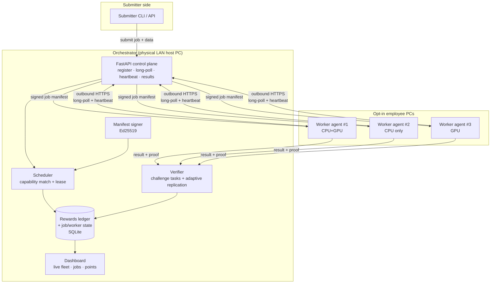
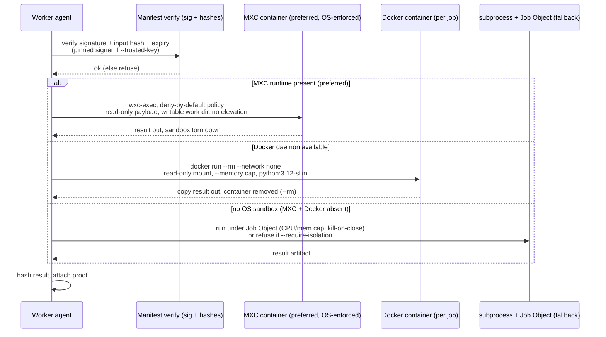
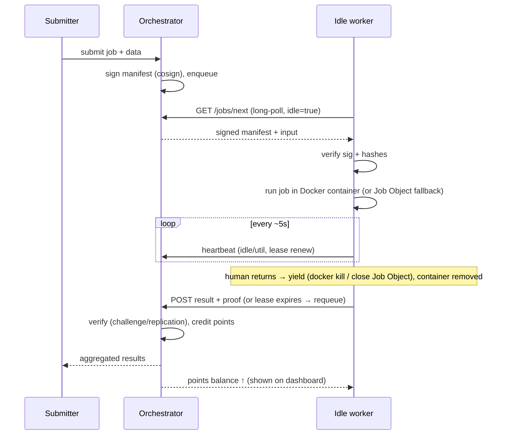

# OneCompute: Architecture

> Proposed system design for the hackathon proof-of-concept.
> Companion to [`idea.md`](./idea.md). Every choice here is biased toward **demoable on a few Windows PCs in hackathon time**, with a clear line between *PoC* and *roadmap*.

---

## 1. Design constraints (what shapes every decision)

| Constraint | Consequence |
|---|---|
| Workers are **managed Windows employee PCs** | Outbound-only networking; no inbound ports; must coexist with Defender/Intune (see §9). |
| Workers are **idle, preemptible, heterogeneous** | Jobs must be idempotent, checkpointable, and re-assignable; scheduler matches on capability. |
| **Both AI and non-AI**, **CPU and GPU** | A job is a generic signed, sandboxed unit of work, not an AI-specific RPC. |
| **Privacy on both sides** | Per-job sandbox + signed manifests + no-persistence; data minimization; result verification. |
| **Hackathon timebox** | Prefer single self-contained binaries / the already-borrowed `uv` env over heavy clusters (no Kubernetes, no multi-node Ray). |

---

## 2. Component overview



**Five moving parts:**

1. **Worker agent**: Python process on each opt-in PC. Detects idleness, advertises capability, pulls signed jobs, runs them in a sandbox, returns results, yields instantly when the human returns. When the fleet runs gated, it first **joins via a device-code approval** (shows a short code, waits until an admin approves it in the dashboard) and then streams live per-device usage (~1s).
2. **Orchestrator**: FastAPI app on the dev box. Control plane + scheduler + verifier + ledger + dashboard. One process for the PoC. It also exposes a **dashboard-facing API** (approve a worker, launch a whole workload across the fleet in one call, read a workload/job's output, list the launch catalog); see §4.1 and [`dashboard-api.md`](./dashboard-api.md).
3. **Job/manifest model**: the signed contract between submitter and worker.
4. **Sandbox runtime**: an **MXC OS-enforced container** when a real `wxc-exec` runtime is present, else a **Docker container per job** (`--network none`, read-only mounts, `--rm`), else an always-available **subprocess + Job Object** fallback. A worker can run `--require-isolation` to **fail closed** (refuse the job) rather than use the unsandboxed fallback (Windows Sandbox is the documented ideal; see §3.3).
5. **Rewards/metering service**: turns verified work into points.

> **Demo workloads.** The PoC fans an **example workload catalog, originally four, now ~10 launchable kinds** (`fractal`, `optimize`, `ai.batch_infer`, `ai.synth`, `montecarlo`, `hashcrack`, `ai.infer`, `ai.eval`, `ai.graph`, `data.transform`), across the fleet. The original worked example is two non-AI (`fractal`, `optimize`) and two AI (`ai.batch_infer`, `ai.synth`), with a **hardcoded split (one tile per machine)**; the dynamic governor (§3.2) is deliberately set aside for the demo. Fully documented in [`workloads.md`](./workloads.md) (and §6).

---

## 3. The worker agent

The agent is the hard, interesting part. It runs as a normal user-session process (see the session-0 gotcha in §3.2).

### 3.0 Joining the fleet (device-code approval) & live usage

When the orchestrator runs gated (`python -m orchestrator --require-approval`), the agent **joins before it works**: `/register` returns `approved=false` plus a short, human-readable `device_code` (e.g. `WX7Q-12`). The agent prints the code and blocks in `wait_for_approval()` (heartbeating on its normal cadence) until an admin clicks **Approve** in the dashboard (`POST /workers/{id}/approve`). `GET /jobs/next` returns 204 for an unapproved worker, so no work leaks before admission. This is additive: the default (non-gated) flow auto-approves and is unchanged.

Once joined, a **daemon heartbeat streams live per-device usage** (`cpu_pct` / `gpu_pct` / `free_ram_gb`) every ~1s (`--usage-interval`, floored at 0.25s) so the dashboard's per-machine usage graph stays current even between jobs. It's pure telemetry: it never carries a `current_job_id`, so it can't perturb leasing. `GET /state` exposes these for the dashboard.

### 3.1 Capability advertisement
On startup and registration the agent reports a **resource dict** (the abstraction borrowed from [Ray's logical-resource model](https://docs.ray.io/en/latest/ray-core/scheduling/resources.html), *not* the framework):

```jsonc
{
  "worker_id": "DESKTOP-AB12...",      // stable, tied to corp identity / SSO
  "cpus": 16,
  "ram_gb": 32,
  "has_gpu": true,
  "gpu_model": "RTX 4070 Laptop",      // via pynvml
  "gpu_vram_gb": 8,
  "accel": ["cuda", "directml"],
  "benchmarked_tops": 312,             // measured, not nameplate (see idea.md §3)
  "labels": ["windows", "ac-only-ok"]
}
```

> **Benchmark, don't trust TOPS.** On first idle window the agent runs a short calibration job; the scheduler uses *measured* throughput for sizing and for fair reward metering.

### 3.2 Demand-adaptive admission (the make-or-break UX)

OneCompute doesn't just wait for a fully-idle machine: it harvests the **learned spare headroom** even during light foreground use, and backs off the instant the employee needs the machine (idea.md §5). The worker runs a **demand-adaptive governor** (`src/worker/governor.py`) over the same Win32/NVML signals, all callable from Python via `ctypes`/`pynvml`:

| Signal | Win32 API | Why |
|---|---|---|
| Input idle (ms since last keyboard/mouse) | [`GetLastInputInfo`](https://learn.microsoft.com/en-us/windows/win32/api/winuser/nf-winuser-getlastinputinfo) | The hard **"human is back"** floor → instant yield. |
| System CPU utilization | [`GetSystemTimes`](https://learn.microsoft.com/en-us/windows/win32/api/sysinfoapi/nf-sysinfoapi-getsystemtimes) (idle/kernel/user deltas) | The live demand signal for admission + saturation yield. |
| Lock / unlock / session change | [`WTSRegisterSessionNotification`](https://learn.microsoft.com/en-us/windows/win32/termserv/wm-wtssession-change) | **Event-driven**, sub-second "human is back" trigger. |
| AC vs battery | [`GetSystemPowerStatus`](https://learn.microsoft.com/en-us/windows/win32/api/winbase/nf-winbase-getsystempowerstatus) + `RegisterPowerSettingNotification` | Enforce "never on battery". |
| GPU utilization | [NVML / `pynvml`](https://github.com/gpuopenanalytics/pynvml) (ships with NVIDIA driver) | **Keyboard-idle ≠ GPU-idle**: a user can be away while a render/game runs. |

**Two thresholds, two phases:**
- **Admission** (between jobs, when no OneCompute job runs, so live CPU ≈ the employee's own demand): admit only when on-AC, unlocked, GPU below cap, the **hour-of-week bucket has headroom**, and live CPU is below a **time-aware threshold** (`profiled_mean + margin`). This is what lets it run during *light* use, not only at full idle.
- **Yield** (during a job, polled ~10×/s): yield once the **employee's own attributed demand** (`system − our job tree`, via `psutil`) exceeds the **time-aware yield threshold** for several samples → close the Job Object → the process tree dies sub-second → requeue, **resuming** when demand falls back into the headroom. It tolerates mere input (typing while we use spare headroom is fine); the hard *mouse-touch → instant-yield* reflex remains the binary `IdleGate`'s behavior (`--governor idle`) and the demo's explicit beat.

**Usage profile (`src/worker/profiler.py`):** a rolling, **on-device** store of per-(hour-of-week) min / avg / peak CPU·GPU·RAM, learned **only from job-free samples** so the envelope reflects the *employee's* usage and not the agent's. Persisted locally (e.g. `%LOCALAPPDATA%\OneCompute`); only the derived spare-capacity number is ever advertised (idea.md §8).

> ⚠️ **Session-0 bug (easy, demo-killing).** `GetLastInputInfo` is **session-specific**. If the agent runs as a SYSTEM service in session 0 it reports *always idle*. The detector **must run in the interactive user session.**

**Yield path:** on the mouse-touch floor or sustained saturation → **hard-kill + requeue** (the PoC's resumable story; closing the sandbox's Job Object handle, `JOB_OBJECT_LIMIT_KILL_ON_JOB_CLOSE`, tears down the whole process tree cleanly for sub-second preemption).

> **PoC scope:** conservative defaults (**25%** margin, **80%** admission ceiling, **+10%** yield hysteresis, **15%** min headroom, 3 sustained samples). The employee's own demand is **attributed via `psutil`** (`user_cpu = system − our job tree`), so the governor never yields on its own load and tolerates input while harvesting headroom. A Docker job's container runs in the WSL VM (not a child process), so its CPU isn't subtracted yet: `docker stats` accounting or a Job Object **`CpuRate`** self-cap is the next refinement. Disclosed honestly.

### 3.3 Job execution & sandbox



- **Preferred boundary (when present) = an MXC (Microsoft Execution Containers) OS-enforced container** (`src/isolation/mxc.py`): `active_boundary()` selects it when `wxc-exec --probe` passes, using a deny-by-default policy, read-only payload, writable per-job work dir, and no elevation. It is **fail-closed and inert until a real runtime exists** (the probe reports unavailable on absent binaries, errors, timeouts, or host-prep warnings), so current machines keep their Docker/Job-Object behavior. Merged but not yet validated against a real runtime; the launch/policy/probe wiring is exercised end-to-end against a stub runtime (see [`mxc-validation.md`](./mxc-validation.md)) while the real-runtime validation remains pending. See also [`mxc-sandbox.md`](./mxc-sandbox.md).
- **Implemented boundary = a Docker Linux container per job** (`src/isolation/runner.py` → `isolation/docker.py`): `docker run --rm --network none`, read-only input mount, `--memory` cap, base image `python:3.12-slim`. **Disposable** (`--rm` → no-persistence for free), no inbound network, killable by name (`docker kill`) for sub-second yield, and it needs **no admin / Hyper-V / nested-virt**, so it runs on any demo PC.
- **Always-available fallback = a subprocess under a [Windows Job Object](https://learn.microsoft.com/en-us/windows/win32/procthread/job-objects)** (`src/isolation/jobobject.py`): CPU/memory caps + `JOB_OBJECT_LIMIT_KILL_ON_JOB_CLOSE` (closing the handle tears down the whole process tree). `runner.py`'s `active_boundary()` reports which path is live and logs a WARNING when it degrades to this path. A worker started with **`--require-isolation` fails closed here** (raises `IsolationUnavailableError` and refuses the job) rather than run unsandboxed, and likewise refuses host-side GPU/AI when no OS sandbox is present.
- **Documented ideal (not built in the PoC) = [Windows Sandbox](https://learn.microsoft.com/en-us/windows/security/application-security/application-isolation/windows-sandbox/windows-sandbox-configure-using-wsb-file)** via a generated `.wsb`: Hyper-V kernel isolation, disposable, read-only `MappedFolders`, `Networking=Disable`. It needs Win Pro/Enterprise + Hyper-V + elevation (and won't nest in a VM), so the PoC ships the Docker path by default and keeps Hyper-V isolation as the security-boundary upgrade. See §13.

> **GPU-in-Sandbox is documented NOT to work** (the critique pass confirmed this): `VGpu=Enable` exposes only the Microsoft Virtual Render Driver, so **CUDA DLLs are absent and CUDA jobs fail** ([Windows-Sandbox issue #42](https://github.com/microsoft/Windows-Sandbox/issues/42), closed "not planned"). **PoC decision (see §13):** CPU jobs run in the Docker container sandbox for a real isolation beat (Windows Sandbox where one is available); **GPU jobs run host-side under a Job Object** where CUDA sees the real device, with the verbal caveat that GPU memory-isolation is the TEE roadmap. Timebox any GPU-in-Sandbox spike to ~3h, then take the fallback.

---

## 4. Orchestrator

A single FastAPI app (uses the already-borrowed `uv` env: `fastapi` + `uvicorn` + `pydantic`).

### 4.1 Control-plane API (outbound-only, NAT/firewall-proof)

Workers **phone home**: no inbound listener, traverses corporate proxies:

| Endpoint | Purpose |
|---|---|
| `POST /register` | Worker announces capability dict; gets a worker token (+ a `device_code` and `approved=false` when the fleet is gated). |
| `GET /jobs/next?worker_id=…` | **Long-poll** (~60s). Returns a signed manifest when a matching job exists, else 204. **Gated:** returns 204 while the worker is unapproved (or blacklisted). |
| `POST /heartbeat` | ~5s liveness + current idle/util state (+ live cpu/gpu/free-RAM usage); renews lease; reports current `approved` state. |
| `POST /workers/{id}/approve` | **Dashboard admits a pending worker** (clears its device code): the credential/onboarding gate. |
| `POST /results/{job_id}` | Result artifact + proof hash. |
| `POST /workloads` | **Dashboard launch:** `{kind, n_tiles, params}` → builds the hardcoded fleet split and enqueues every tile under a shared `workload_id` → `{workload_id, job_ids}`. |
| `GET /workloads/{id}` | A launched workload's per-tile status + outputs (the results panel). |
| `GET /workloads/catalog` | The launchable example workloads (kind, label, category, default params) so a UI renders launch buttons without hardcoding. |
| `GET /jobs/{id}` | A single job's full record incl. its parsed output. |
| `GET /` | Dashboard (SSE/websocket for live updates). |

Pattern from the [Temporal worker model](https://docs.temporal.io/develop/worker-performance) (outbound long-poll). **Liveness = heartbeat → lease → reaper:** heartbeat ~5s, lease ~20–30s, requeue on expiry, jobs idempotent.

> **Validate transport on the real LAN early.** Plain HTTPS long-poll is the safe choice; gRPC (HTTP/2) and WebSocket upgrades get blocked by some corporate middleboxes, so keep those as roadmap upgrades.

### 4.2 Scheduler

- **Capability match:** bin-fit a job's requirement dict against worker resource dicts (`needs_gpu`, `min_vram`, `accel`). This routing logic is **bespoke**, not free from any queue library.
- **Lease + preemption:** assign → lease; if a worker's heartbeat says "human returned" or the lease expires, **requeue** to another idle worker. The original worker checkpoints and drops out.
- **Job queue:** for the PoC, a **SQLite-backed work queue** the orchestrator owns and serves via long-poll: zero extra infra, uses the borrowed env. **Upgrade path:** [NATS JetStream](https://docs.nats.io/nats-concepts/jetstream) (single self-contained Windows binary, WorkQueue retention = at-least-once pull + one-worker-per-job, survives worker drop) when we outgrow a single orchestrator. *(Avoid Ray multi-node: "experimental and untested" on Windows; avoid RQ: needs `os.fork()`.)*

### 4.3 Verifier

Cheap-first, trust-aware (don't waste capacity on blanket replication):

1. **Challenge / "ringer" tasks**: inject decoy work units with server-known answers ([Golle & Mironov, MSR](https://www.microsoft.com/en-us/research/wp-content/uploads/2001/04/dist.pdf)). A wrong decoy → blacklist worker + forfeit points. Cheap, demoable, doubles as anti-gaming.
2. **Adaptive replication** ([BOINC](https://github.com/BOINC/boinc/wiki/AdaptiveReplication)): new/low-trust machines and high-value jobs get N-way replication; trusted internal machines run mostly **unreplicated + spot-checked**.
3. **Tolerance-aware comparators**: never bitwise equality (heterogeneous FP differs in low-order bits). AI outputs use per-workload fuzzy comparison (logit/embedding distance).

---

## 5. Job & manifest model

A job is a **signed manifest** + input payload. The manifest is the trust contract.

```jsonc
{
  "job_id": "uuid",
  "kind": "ai.batch_infer | eval | data.transform | render | challenge | fractal | optimize | ai.synth",
  "code_ref": "oci://… or script hash",   // what to run
  "code_sha256": "…",
  "input_sha256": "…",
  "requires": { "needs_gpu": true, "min_vram_gb": 6, "accel": ["cuda"] },
  "limits":  { "cpu_pct": 60, "mem_gb": 8, "timeout_s": 600, "network": "none" },
  "sandbox": { "type": "docker", "vgpu": true, "mapped_ro": ["in/"] },
  "issued_at": "…", "expires_at": "…"
}
```

- **Signed with Ed25519** (`src/trust/signing.py`; cosign/OIDC is the roadmap, see §11). The worker verifies signature + `input_sha256` + expiry **before** executing and refuses on mismatch. By default the public key travels with the manifest (integrity); a worker can **pin an out-of-band signer** with `--trusted-key` / `$ONECOMPUTE_TRUSTED_PUBKEY` so a compromised orchestrator or MITM cannot inject a self-signed job ([BOINC code-signing pattern](https://github.com/BOINC/boinc/wiki/SecurityIssues)).
- **Workload grouping.** Jobs launched together via `POST /workloads` (the fleet tiles of one workload) share a `workload_id` column so the dashboard can read them back as a unit (`GET /workloads/{id}`).
- **Tamper-evident audit log** (Rekor-style append-only) of who-submitted-what-ran-where: the non-repudiation property an enterprise security review demands.

---

## 6. Workload adapters

The same fabric carries different job kinds via small adapters. The PoC ships an **example workload catalog, originally four, now ~10 launchable kinds**, fanned across the fleet via a **hardcoded split: one tile per machine** (`src/workloads/partition.py`, `even_ranges`/`weighted_ranges`); the dynamic governor is set aside for the demo. The four below are the original worked examples: two non-AI and two AI, to show range. Full per-workload detail (inputs, outputs, aggregation, preemptibility) lives in [`workloads.md`](./workloads.md), not duplicated here.

| Job kind | AI? | Runtime on worker | PoC demo use |
|---|---|---|---|
| `fractal` | no | **Pure-stdlib** executor, runs inside the Docker sandbox | Non-AI CPU job: Mandelbrot tiles reassembled into one PNG. |
| `optimize` | no | **Pure-stdlib** executor, runs inside the Docker sandbox | Non-AI CPU job: distributed param-sweep; global best wins. |
| `ai.batch_infer` | yes | Real **anthropic/openai SDK**, routes **host-side** | The AI job: each worker scores a slice of the prompt set. |
| `ai.synth` | yes | Real **anthropic/openai SDK**, routes **host-side** | AI job: each worker generates a slice of synthetic data, merged. |
| `challenge` | no | Same as a real job, known answer | Verification + anti-gaming (§4.3). |

> **Why the AI kinds run host-side.** The non-AI executors are pure stdlib so they run **inside** the `python:3.12-slim` Docker sandbox, which gets **no API key** (`isolation/runner.py` forwards provider keys host-side only). So `worker/agent.py` routes any `ai.*` kind to the on-host Job-Object path where the real SDK + key are available; **without a key the AI kinds use a disclosed deterministic fallback**, so they always run. (`eval` / `data.transform` / `render` remain as adapter kinds; the four above are the ones the demo actually fans out.)

> **Deliberately NOT in the PoC:** sharding one model across machines (llama.cpp RPC / exo / Petals). Those transports are "fragile and insecure… never run on an open network": they're a scripted **roadmap** showcase on an isolated network, not the demo path.

---

## 7. Rewards & metering service

```
credits = validated_work × resource_class_multiplier × scarcity_multiplier × uptime_factor
```

- Meter **verified useful work only** (validated job completion + passed challenges), never claimed FLOPS.
- Borrow [BOINC CreditNew](https://github.com/BOINC/boinc/wiki/CreditNew) anti-cheat: per-host normalization, capped per-host multiplier, recent-average-credit decay, probation for new machines.
- A resource-class + uptime baseline keeps CPU-only / older machines earning fairly.
- Ledger lives in the same SQLite store; the dashboard shows points accruing live.

---

## 8. Data & control flow (end to end)



---

## 9. Security, privacy & enterprise acceptance

| Layer | PoC (build) | Roadmap (document) |
|---|---|---|
| **Isolation** | **MXC preview backend** ([`microsoft/mxc`](https://github.com/microsoft/mxc)) when `wxc-exec --probe` passes, using a deny-by-default policy, read-only payload, writable job work dir, no elevation, and graceful fallback to Docker (`--network none`, ro mounts, `--rm`) then subprocess/Job Object. A worker can run **`--require-isolation` to fail closed** (refuse the job) when no OS-enforced sandbox is available. MXC preview is not claimed as a hard security boundary yet, and Windows denied-path enforcement still needs validation. | Windows Sandbox (Hyper-V) where available; AppContainer / Win32 App Isolation; production MXC once preview caveats are retired and policy enforcement is validated |
| **Code/data integrity** | **Ed25519-signed** manifests, hash + expiry verify before run; optional **out-of-band pinned signer** (`--trusted-key`) blocks a self-signed job from a compromised control plane | cosign/OIDC/Rekor + full SLSA-style provenance |
| **Transport** | optional **TLS** (`--tls-cert/--tls-key`) and **mutual TLS** (`--tls-client-ca` server; `--client-cert/--client-key` worker, pinning the CA via `--tls-ca`); per-client **rate limiting** (`--rate-limit`, default 600/min, 429 + Retry-After) | TLS on by default; automated cert issuance/rotation; WAF; network segmentation |
| **Result trust** | challenge tasks + adaptive replication + fuzzy comparators | formal verifiable compute |
| **Confidentiality** | data minimization, no-persistence | **TEE / confidential compute** (needs datacenter GPUs: consumer RTX/NPU have no GPU TEE) |
| **Onboarding / admission** | **device-code dashboard-approval gate** (`--require-approval`): a joining worker is PENDING with a short code until an admin approves it; gets no work until then | Intune/SSO-driven enrollment + per-worker certs |
| **Submission auth** | optional operator **`--submit-token`** gates job/workload submission (`Authorization: Bearer`, constant-time, audited); the PoC form of submitter SSO | submitter SSO/OIDC + per-team scopes/quotas |
| **Supply chain** | dependency pinning (`uv.lock` + pinned `cryptography` trust root); a generated **CycloneDX SBOM** (`scripts/generate_sbom.py`, see [`supply-chain.md`](./supply-chain.md)) for CVE scanning; Ed25519 manifest signing | cosign/OIDC/Rekor build signing + SLSA provenance; signed update channel |
| **Auditability** | append-only audit log (incl. an `approved` event) | Rekor transparency log |

> **The enterprise-acceptance gate (highest risk).** Sustained CPU/GPU bursts are the literal signature of [cryptojacking](https://www.cisa.gov/news-events/news/defending-against-illicit-cryptocurrency-mining-activity); Purview DLP can silently block a job's data egress. The agent must be **code-signed, Intune-deployed, Defender/AV allow-listed, and route I/O through sanctioned channels**, designed to **pass, not bypass**. Internal scope shrinks attack surface and makes actions attributable; it does **not** let us skip controls. ([Purview endpoint DLP](https://learn.microsoft.com/en-us/purview/endpoint-dlp-learn-about))

---

## 10. PoC build plan (suggested order)

> **Current status (branch `main`):** steps 2–9 are implemented and green (239 tests pass, 2 skipped), plus the additive dashboard-readiness layer (device-code approval gate, four fanned example workloads, `POST /workloads` launch + read API, live per-device usage stream). The dashboard **front-end UI is owned by the dashboard team**; the backend is integration-ready (see [`dashboard-api.md`](./dashboard-api.md)); we don't ship a finished UI.

1. **Spike the two unknowns first** *(de-risk day 1)*: (a) GPU passthrough into Windows Sandbox on the real demo SKU; (b) plain-HTTPS long-poll reachable across the corporate LAN.
2. **Orchestrator skeleton**: FastAPI: `register`, `jobs/next` (long-poll), `heartbeat`, `results`; SQLite state; in-process scheduler.
3. **Worker agent v0**: register, long-poll, run a trivial subprocess job, heartbeat, report result.
4. **Idle gate**: `GetLastInputInfo` + lock/unlock + AC + GPU util; checkpoint-and-yield on the "human's back" lever.
5. **Sandbox wrapper**: a Docker container per job (`--network none`, read-only mounts, `--rm`); run job inside, copy result out, confirm wipe; subprocess + Job Object fallback with caps. *(Windows Sandbox `.wsb` is the documented upgrade; see §3.3 / §13.)*
6. **Signing**: cosign-sign manifests; worker verifies before run.
7. **Two real workloads**: `ai.batch_infer` (prompt-set slice via local model server) + `data.transform`/`render` (CPU/GPU non-AI).
8. **Verifier + rewards**: challenge tasks; points ledger.
9. **Dashboard**: live fleet, idle/busy, jobs flowing, throughput, points ticking; the **mouse-touch → instant yield** moment.

**Demo machines:** run the **orchestrator + dashboard on a physical LAN PC** (the cloud dev box is for editing/building only: it has no inbound LAN route from worker laptops, no GPU, and can't run Windows Sandbox). Add 2–3 Windows worker PCs (≥1 with NVIDIA GPU for the host-side GPU/pynvml path). Prove one real worker reaches the orchestrator over HTTPS in the first hour. See §13.

---

## 11. Tech stack

| Concern | PoC choice | Why / source |
|---|---|---|
| Control plane | **FastAPI + uvicorn** (borrowed `uv` env) | Outbound long-poll, no inbound ports. |
| Transport | HTTP by default; **optional TLS + mutual TLS** (uvicorn `ssl_*` server, pinned-CA + client-cert httpx worker) and **per-client rate limiting** | Plain HTTP for the local demo; TLS/mTLS + rate limit for a pilot. TLS-everywhere + auto cert rotation is roadmap. |
| State / queue / ledger | **SQLite** | Zero infra; one orchestrator. → NATS JetStream later. |
| Worker agent | **Python + ctypes + pynvml** | Win32 idle APIs + GPU advert, no heavy deps. |
| Isolation | **MXC OS-enforced container** when a `wxc-exec` runtime is present, else **Docker per job** (`--network none`, ro mounts, `--rm`), else subprocess/Job Object fallback; `--require-isolation` fails closed | Preferred OS boundary is MXC; Docker is the zero-admin default; instant kill-on-close. Windows Sandbox is the documented ideal. |
| Signing | **Local Ed25519** (`cryptography`, pinned direct dep) for the PoC; optional **out-of-band pinned signer** (`--trusted-key` / `$ONECOMPUTE_TRUSTED_PUBKEY`) | ~30 lines; demo the *refusal* on a flipped byte. cosign/OIDC is roadmap (needs egress + SSO wiring). |
| AI workload | **Ollama** (local, OpenAI-compatible) + **anthropic / openai SDK** | Embarrassingly-parallel batch inference. |
| Inference clients | **anthropic / openai SDKs** (borrowed env) | For eval/agent job kinds. |
| Dashboard | **FastAPI + SSE/WebSocket + lightweight web UI** | Live fleet + points. |

---

## 12. Roadmap (beyond the PoC)

- **NPU harvesting** - ONNX Runtime + DirectML/QNN to tap the 40–55 TOPS NPUs (unlocks the 1.8-ExaOPS ceiling story).
- **Cross-machine model sharding** - llama.cpp RPC / exo / Petals on an isolated network for "model too big for one laptop."
- **Confidential compute** - TEE-backed execution for sensitive workloads as datacenter-class GPU TEEs reach the desk (Surface RTX Spark Dev Box / DGX Station tier).
- **Durable queue + multi-orchestrator** - NATS JetStream / Temporal for production scale.
- **Super-node tier** - schedule heavy jobs onto Surface RTX Spark Dev Box / DGX Station desks alongside the laptop fleet.

---

---

## 13. Hackathon feasibility: critique synthesis

> Synthesized from 5 adversarial practicality critics (timeline, Windows technical risk, day-1 setup, demo impact, privacy/metering realism). **Where these PoC decisions conflict with the idealized design above, these win for the demo.**

### Verdict
**🟡 YELLOW: demoable, but only if you abandon the two headline mechanisms (GPU-in-Windows-Sandbox, orchestrator-on-dev-box) on day 0.** The vertical slice (submit → pull → sandboxed run → result → points tick → mouse-touch instant-yield) is reliably buildable in 1–2 days; the full 9-subsystem plan is not. **Decide the fallbacks NOW, before writing code**: the plan's two "day-1 spikes" are the two least-controllable items, and the cloud dev box (GPU-less, Sandbox-less, LAN-unreachable) can do none of the hard parts.

### Must-fix before demo
1. **Fix the inverted topology (BLOCKER).** Run the orchestrator on a **physical LAN PC**; the dev box is for editing only. "Outbound-only" protects the *worker's* firewall, not the *server's* reachability. Validate one real worker reaching it in hour 1. Use **short poll (1–2s)**, not 60s long-poll, for 2–3 workers.
2. **Don't run GPU jobs in Windows Sandbox (BLOCKER).** `VGpu=Enable` breaks CUDA (MS issue #42). CPU job → real Sandbox (genuine isolation beat). GPU job → **host-side under a Job Object** (real CUDA). Timebox any spike to ~3h.
3. **Confirm Windows Sandbox + local admin on each physical demo PC, day 0 (BLOCKER).** Needs Win Pro/Enterprise + Hyper-V + elevation + reboot, won't nest in a VM, and Intune approval takes days. **Fallback: a Docker Linux container per job** (`--network none`, read-only mounts, `--rm`), already working, no admin/feature/nested-virt dependency. Build the Docker path by default unless admin is confirmed.
4. **Build the mouse-touch → instant-yield moment SECOND, not last (BLOCKER).** It's the one hook no slide conveys. `GetLastInputInfo` poll (~250ms) → **close the Job Object handle → process tree dies sub-second** → requeue the slice → flip the dashboard tile. **No real checkpoint/resume**: hard-kill + requeue tells the identical story. Make the job a chunked loop that checks the idle flag between chunks.
5. **Build the dashboard SECOND/THIRD against seeded data (HIGH).** It's 100% of what judges see. Use **Streamlit/Gradio** (or a 500ms-polling HTML page), no hand-rolled SSE/WebSocket.
6. **Drop cosign → local Ed25519 (HIGH).** ~30 lines of `cryptography`; worker refuses on signature/hash mismatch. Demo the **refusal** (flip one byte → rejected): that's the whole trust story.
7. **Pre-stage the AI workload; prefer the SDK (HIGH).** vLLM has **no Windows support: delete it.** For the AI job, call the **anthropic/openai SDK** (env present) so each worker scores a prompt slice: zero model download/GPU. Keep a prebuilt llama.cpp + small pinned GGUF as a stretch beat only.
8. **Demo on machines you control, not Intune-managed laptops (HIGH).** Sustained CPU/GPU from an unsigned agent = cryptojacking signature → Defender can quarantine it mid-demo. Use unmanaged/loaner PCs or an isolated switch/hotspot. Allow-listing is a productionization slide.
9. **Guard pynvml; run the agent as a foreground user process (MEDIUM).** Wrap pynvml in try/except → `has_gpu=false` (it crashes with no NVIDIA driver). Foreground user session avoids the session-0 "always idle" bug. One bootstrap script, run identically on every worker.

### Cut / defer list
True checkpoint/resume → hard-kill + requeue · GPU-in-Sandbox → host Job Object · per-job disposable `.wsb` → one pre-warmed sandbox · cosign/OIDC/Rekor → Ed25519 · vLLM → deleted, local serving → SDK · 60s long-poll → 1–2s short poll · adaptive replication / N-way quorum / fuzzy comparators → **one hardcoded challenge task** with a known answer on a deterministic job · CreditNew/scarcity/uptime → `credits = accepted_units × class_weight` (GPU=5, CPU=1), **server-assigned, never the agent's claimed TOPS** · "tamper-evident" log → add a 20-line prev-hash chain or downgrade the wording · NPU / sharding / NATS / multi-orchestrator / TEE → roadmap slides · real GPU fleet → multiple worker processes on 1–2 laptops + one real second PC.

### Recommended minimal demo (4–5 min, pre-warmed)
1. **Idle fleet (10s):** dashboard shows 2–3 idle tiles, points at 0.
2. **Fan-out, the throughput hook (60s):** submit a CPU-bound embarrassingly-parallel job (hash/param sweep, batch resize). Show a **"1 machine: 90s" ghost bar** vs the live fan-out racing past it; points tick per machine, the GPU machine earning faster (weight=5).
3. **"And it also does AI" (45s):** submit the AI batch job via the SDK: each worker handles a prompt slice. Secondary beat, so model warmup never sinks the throughput moment.
4. **The money shot, instant yield (30s):** touch a worker's mouse; tile flips green→amber **"yielded in 0.3s"**, slice requeues, batch still completes.
5. **Trust beat, caught a cheater (20s):** a `--cheat` worker returns a wrong answer to a hidden challenge task → **"Worker-3 failed integrity check: blacklisted, points forfeited."** It claimed huge TOPS but earned **zero**.
6. **Isolation proof (15s):** a terminal inside the real Sandbox tries to read `C:\Users` → **access denied**; close it → mapped folder gone (no-persistence).
7. **Close on the slide:** the 1.8-ExaOPS ceiling vs the **real measured harvested throughput** from the live fleet.

### Plan B (build the fallback by default; treat the "real" version as a spike you assume fails)
- **GPU-in-Sandbox fails →** GPU job host-side under a Job Object (real CUDA + pynvml util); CPU job in one real Sandbox. *Mock nothing.*
- **Windows Sandbox unavailable →** Docker Linux container per job (already running, zero admin/Hyper-V). Build this as the primary isolation path if admin isn't confirmed by end of day 0.
- **Corporate LAN blocks transport →** run the whole demo on a laptop hotspot / isolated switch; short poll only. Floor case: orchestrator + N worker processes on one PC + one real second PC as the distributed proof, still reads as fan-out on the dashboard.
- **Mock vs build:** *Build real*: orchestrator, agent, idle-gate+yield, CPU job, dashboard, Ed25519 sign/verify, one challenge task, points. *Mock/seed*: `benchmarked_tops` (display constant), AI inference may fall back to a token-proportional sleep if the SDK blows up (parallelism still real; disclose if asked). *Slide only*: TEE, Intune/Defender allow-listing, cosign, NPU, sharding, adaptive replication.

### Suggested build order (de-risked: lock the floor before anything fragile)
0. **Day 0 (in writing):** confirm 1 GPU + 1 plain physical PC with local-admin; confirm a trivial `.wsb` launches (else commit to Docker); pick the orchestrator-host PC and prove a worker reaches it over HTTPS within the hour; pre-stage model/binary/AV-exclusion. *Nothing below starts until reachability + isolation tier + GPU path are decided.*
1. Orchestrator skeleton: FastAPI on the LAN PC: `register`, `jobs/next` (short poll), `heartbeat`, `results`; SQLite/in-memory.
2. **Worker agent v0 + the yield loop**: register, poll, run a chunked subprocess job under a Job Object; idle-poll → close handle → requeue. *The money shot; build it while you have time.*
3. Dashboard (seeded data): Streamlit/Gradio: tiles, points ticker, throughput, green→amber yield flip.
4. CPU fan-out job + the ghost-bar baseline: the throughput hook.
5. Isolation beat: one CPU job in a pre-warmed Sandbox (or Docker); denied `C:\Users` read + wipe.
6. Ed25519 sign/verify + the tamper-refusal demo.
7. AI job via SDK (prompt-slice fan-out); add llama.cpp only if time remains.
8. One challenge task + `--cheat` worker: blacklist + points-forfeit; `credits = accepted_units × class_weight`.
9. GPU job host-side under a Job Object: pure upside; last so it can't block the slice.

---

*Design validated against a deep-research pass (prior art, edge-AI hardware, distribution frameworks, Windows isolation, incentives, enterprise security) and an adversarial hackathon-practicality critique. Key sources are listed in `idea.md` §11 and inline above.*
